# Starting a Node.js Project

## Create a new Node.js Project
- Do npm install if you have a existing package.json file
- Do npm init and follow the manual to create package.json file

## Install new package
the packages may need: express, request(Call to external API)
```
$ npm install --save <package name>
```

## Start from Scratch 
Create a file namely index.js that contains the followings
```javascript
var express = require('express')
 
var app = express()
 
app.get('/notes', function(req, res) {
  res.json({notes: "This is your notebook. Edit this to start saving your notes!"})
})
 
app.listen(3000)
```
You should see the Json file if you try to request to http://localhost:3000

## Call to external APIs
Use request library to do so:
```
request.get({url: "http://localhost:3000/my-api-controller", 
             qs: {url: url}},
            function(error, response, body){
               console.log(body);
            });
```

# Porject Details (screenshots of webpage)
<p align="center">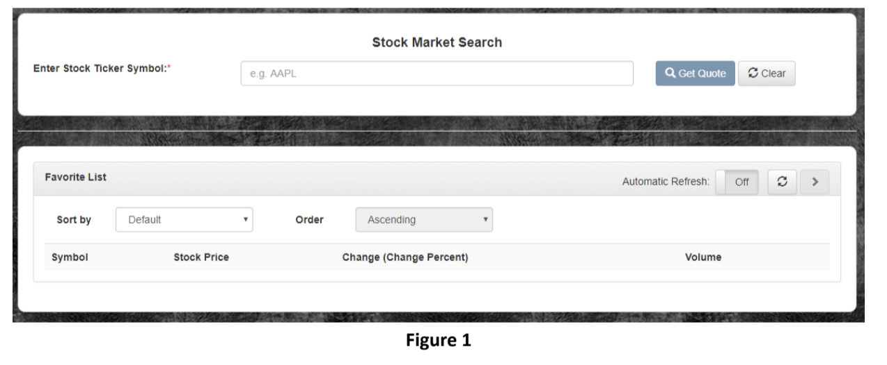</p>
<p align="center">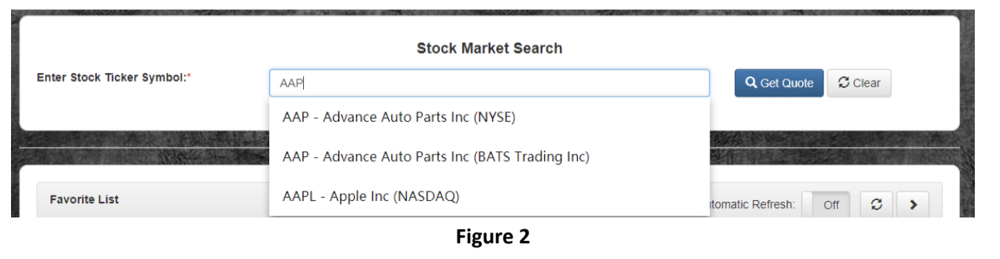</p>
<p align="center">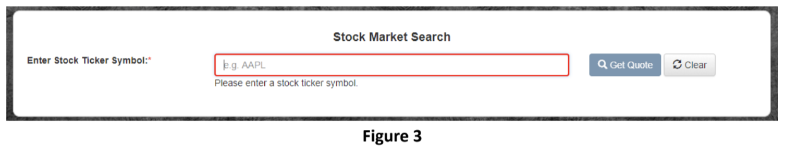</p>
<p align="center">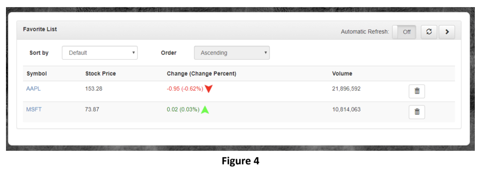</p>
<p align="center">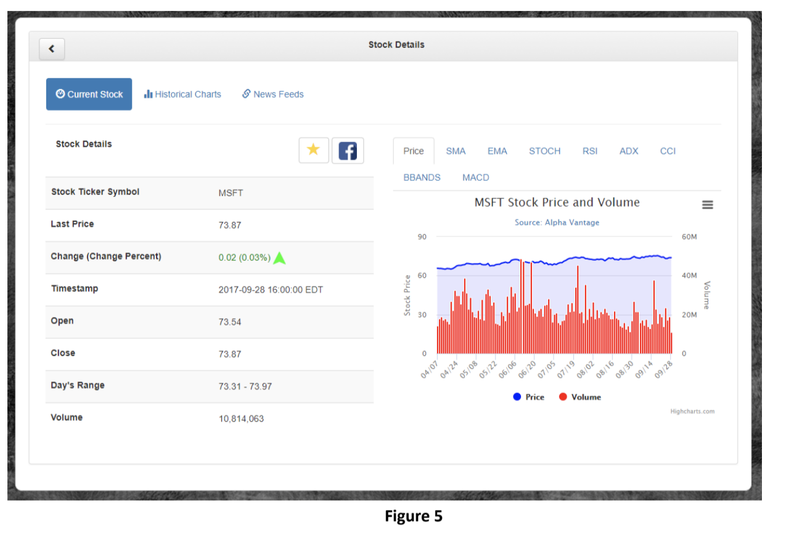</p>
<p align="center">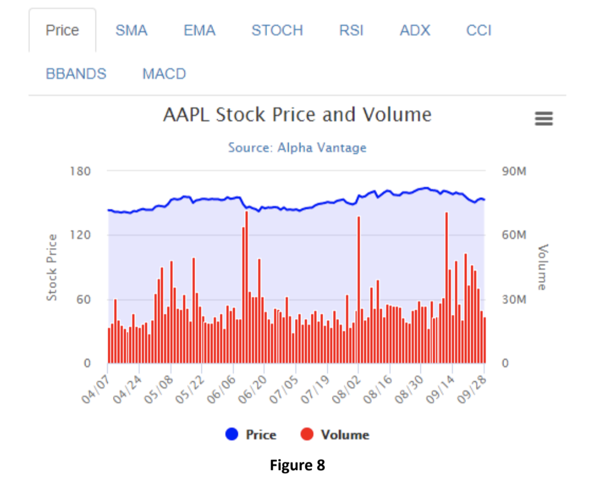</p>
<p align="center">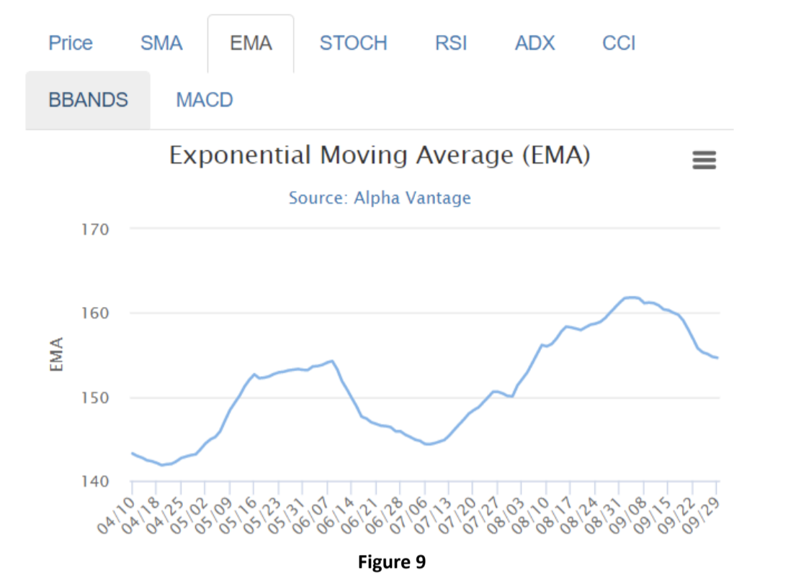</p>
<p align="center">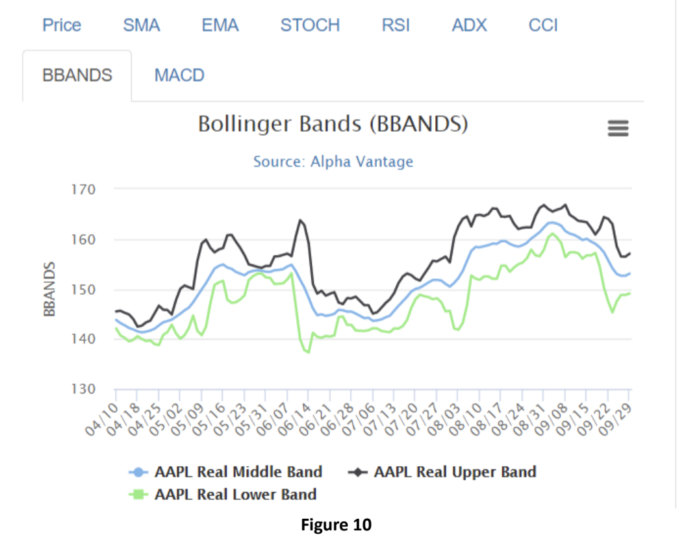</p>
<p align="center"></p>
<p align="center">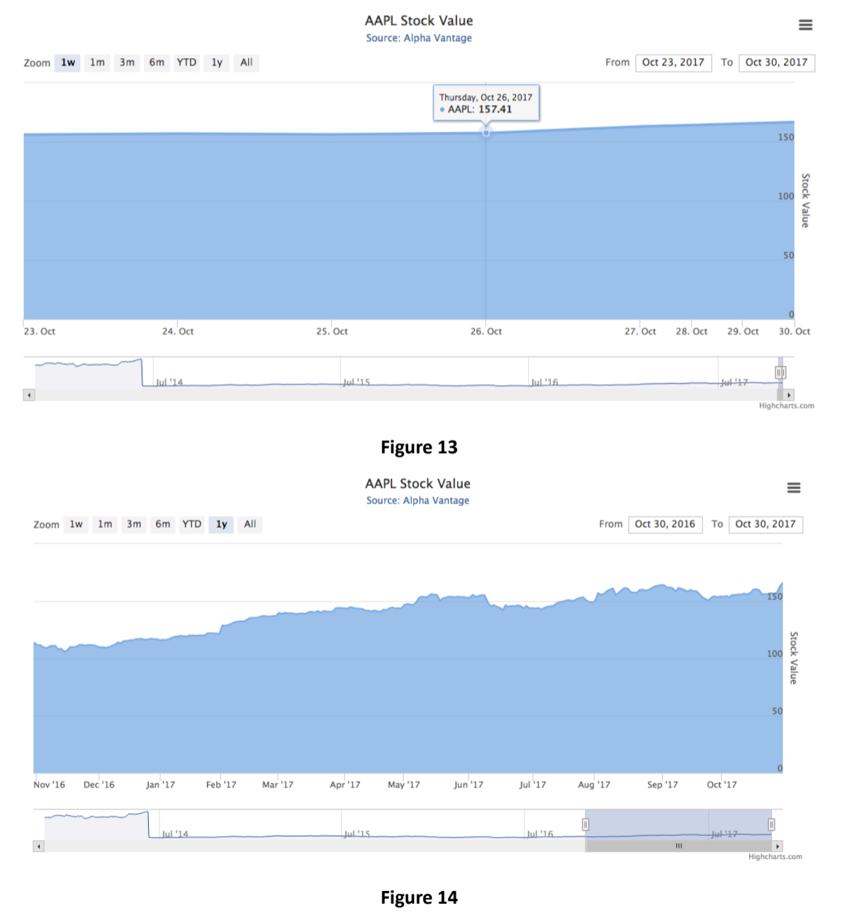</p>
<p align="center">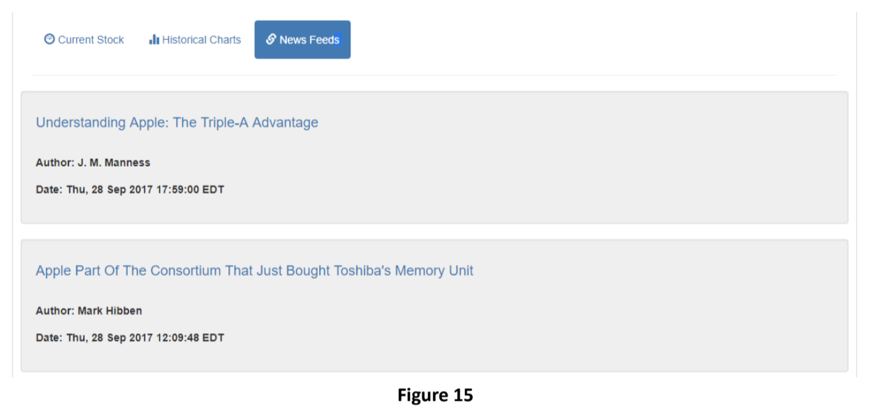</p>
<p align="center">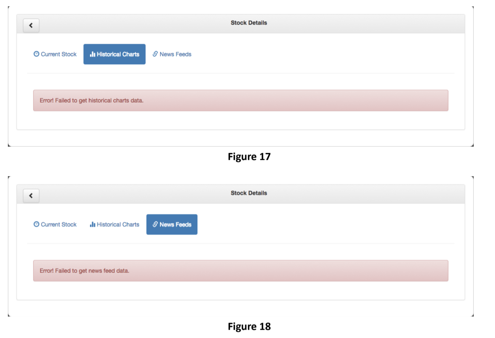</p>
<p align="center">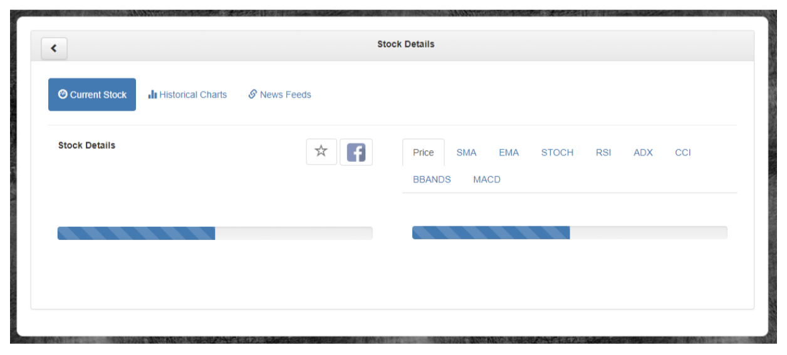</p>

# Porject Details (screenshots of mobile page)

The following are snapshots of the major screens taken on Safari of iPhone 6s.
<p align="center">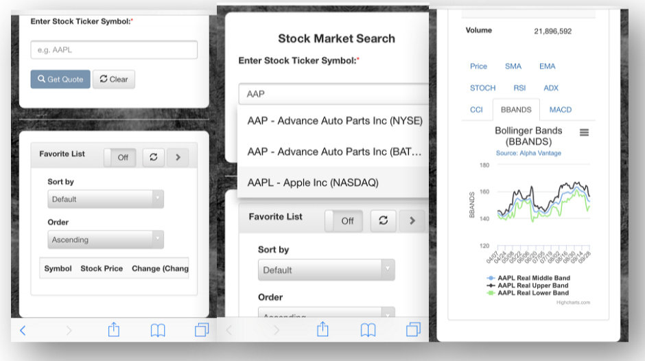</p>
<p align="center">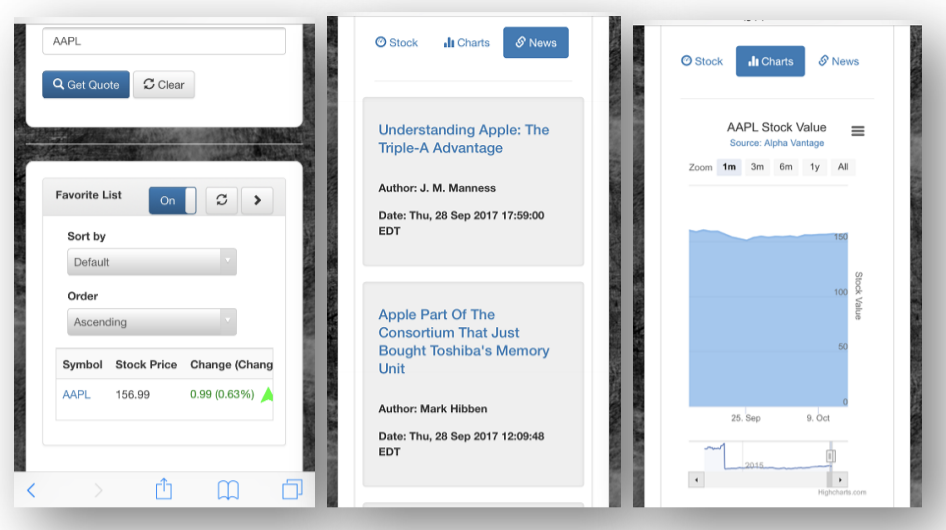</p>
<p align="center">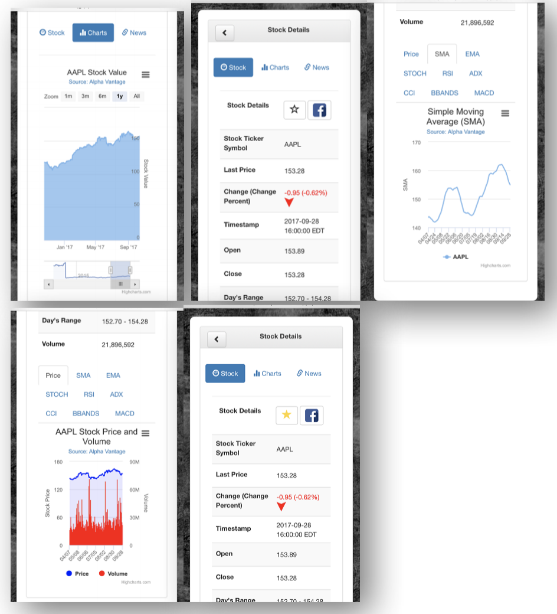</p>
